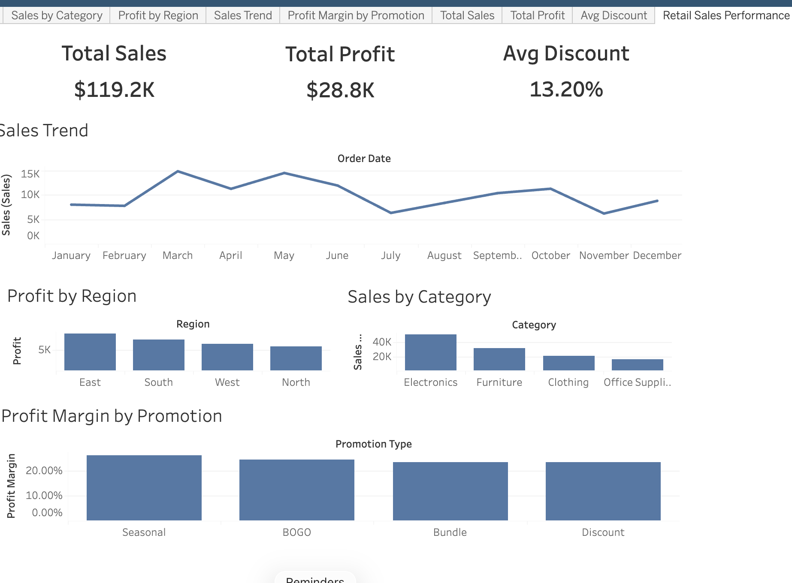

# Retail Sales Performance & Profitability Analysis


**Skills:** Tableau · Data Visualization · Profit Margin Analysis · Promotional Effectiveness · Regional Performance · Sales Trend Analysis

> Analyzed retail sales performance across product categories, regions, promotion types, and time — finding that Electronics dominates revenue but carries the lowest margin, Seasonal promotions outperform discount-based campaigns on profitability, and November represents a critical missed opportunity entering the holiday season.

---

## Dashboard Preview



---

## Overview

This project builds an interactive Tableau dashboard to analyze retail sales performance and profitability across four dimensions: product category, geographic region, promotion type, and time.

The dashboard is structured as a multi-view layout with tabbed navigation — allowing users to drill into Sales by Category, Profit by Region, Sales Trend, and Profit Margin by Promotion independently, while KPI cards provide instant top-line context.

The core analytical question is not just *what sold* — but *what was actually profitable*, and *which promotions and regions are driving margin vs. simply driving volume*.

---

## Dashboard Features

- **KPI Cards** — Total Sales ($119.2K), Total Profit ($28.8K), Average Discount (13.2%)
- **Sales Trend** — monthly line chart tracking revenue across all 12 months of 2023
- **Sales by Category** — bar chart comparing Electronics, Furniture, Clothing, Office Supplies
- **Profit by Region** — bar chart showing East, South, West, North contribution
- **Profit Margin by Promotion** — bar chart comparing Seasonal, BOGO, Bundle, Discount campaign types
- **Tabbed Navigation** — each view accessible independently for focused analysis

---

## Key Findings

| Metric | Value |
|---|---|
| Total Sales | $119,200 |
| Total Profit | $28,800 |
| Average Discount | 13.2% |
| Top Category by Revenue | Electronics ($51.5K — 43% of total) |
| Top Region by Profit | East ($8,929) |
| Best Promotion by Margin | Seasonal (26.2%) |
| Weakest Sales Month | November ($6,150) |

---

## Key Insights

**1. Electronics drives revenue but has the lowest profit margin — a classic volume trap.**
Electronics generates $51.5K in sales — 43% of total revenue — but carries the lowest margin at 18%. The business is over-reliant on a high-volume, low-efficiency category. Shifting promotional investment toward higher-margin categories like Clothing or Furniture could improve overall profitability without requiring more total sales volume.

**2. Seasonal promotions are the most profitable — discount-based campaigns dilute margin.**
Seasonal promotions deliver the highest profit margin at 26.2%, outperforming BOGO, Bundle, and Discount campaign types. Discount-based promotions cost margin without proportionally driving incremental volume. The business should prioritize Seasonal campaign design and reduce reliance on straight discounting.

**3. East region leads in total profit — regional strengths are not being replicated.**
The East region generates $8,929 in profit — the highest of all four regions — driven by strong Electronics and Furniture performance. North trails significantly. Understanding what drives East's outperformance (customer mix, product availability, promotional timing) could inform strategies to lift underperforming regions.

**4. November is the weakest sales month at $6,150 — a missed holiday opportunity.**
For a retail business, November should be one of the strongest months of the year given Black Friday and pre-holiday demand. Instead it records the lowest sales of any month. This points to either a promotional gap or a targeting failure during the highest-intent buying period of the retail calendar. A targeted Seasonal campaign in November could have significant upside.

---

## What I'd Build With Real Data

With a production dataset, the analysis would be extended to include:

- **Margin waterfall by promotion type** — showing exactly how each campaign type erodes gross margin step by step
- **Category × Region cross-tab** — to identify which combinations drive the best margin efficiency
- **YoY trend comparison** — to distinguish seasonal patterns from growth or decline
- **Promotional lift analysis** — measuring incremental sales above baseline during campaign periods
- **Customer segmentation** — RFM analysis to identify high-value segments by region and category

---

## Tools Used

| Tool | Usage |
|---|---|
| Tableau Desktop | Dashboard design, multi-view layout, interactive visualization |
| Excel | Source dataset (RetailPromotions2023.xlsx) |

---

## Key Learning

This project reinforced that **revenue and profitability tell different stories** — and a dashboard that only shows sales totals can actively mislead business decisions. Electronics looks like a success story at the revenue level. At the margin level, it is the weakest performer. The analytical value is in surfacing that gap, not confirming the obvious.

---

## File Structure

```
├── Retail_Sales_Performance___Profitability_Analysis.png   # Dashboard screenshot
├── RetailPromotions2023_.xlsx                              # Source data
└── README.md
